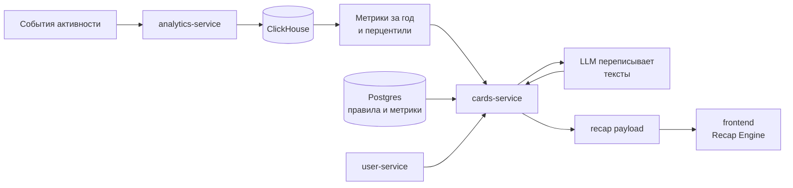

# Правки по замечаниям ментора Implementation Plan

> **For agentic workers:** REQUIRED SUB-SKILL: Use superpowers:subagent-driven-development (recommended) or superpowers:executing-plans to implement this plan task-by-task. Steps use checkbox (`- [ ]`) syntax for tracking.

**Goal:** Закрыть четыре замечания ментора по демо-рекапу, сделав порог показа сравнения настраиваемым на каждую метрику, тексты понятными, лишнюю метрику удалённой, а README информативным.

**Architecture:** Все изменения контента живут в данных, а не в коде. Пороги сравнения переезжают в новую колонку `metric_definitions.comparison_min_percentile`, тексты сравнений в поле `comparisonTemplate` внутри payload правил `story_rules`. Go-код меняется минимально, в двух местах, при загрузке правил и при сборке сцены. Каждая правка контента дублируется в сиде для чистой базы и в миграции для существующей.

**Tech Stack:** Go 1.x (cards-service, analytics-service, seed-data), Postgres, ClickHouse, React + Vite (frontend), Docker Compose, Playwright через npx для разовых скриншотов.

## Global Constraints

- Спека, из которой вырос план: `docs/superpowers/specs/2026-08-11-mentor-feedback-design.md`.
- Пакеты `recap-engine` не трогаем. Фронтенд подключает `@recap-engine/core` и `@recap-engine/react` как опубликованные npm-пакеты с фиксированными версиями, установлена версия ядра 1.2.0, поэтому правка исходников движка в приложение не попадёт без релиза пакета.
- Сиды `story_rules` вставляются через `ON CONFLICT (id) DO NOTHING`, поэтому любая правка текста правила обязана дублироваться миграцией с `UPDATE`. Правка только сида на существующей базе не применится.
- Уже применённые миграции не редактируем. Любое изменение накатывается новым файлом.
- Тесты Go запускаются командой `go -C cards-service test ./...`, линтер командой `golangci-lint run -c .golangci.yaml ./cards-service/... ./analytics-service/... ./user-service/...` из корня репозитория.
- Дефолт порога сравнения 50. Значение `NULL` в колонке означает «взять дефолт».
- Перцентиль 0 не показывается никогда, независимо от порога.
- Рабочее дерево содержит крупный незакоммиченный набор чужих изменений, перенос реестра событий analytics в Postgres. Задачи наслаиваются поверх него, `git add` делается только по перечисленным в задаче файлам, `git add -A` запрещён.

## Отклонения от спеки

Два намеренных отклонения, оба в сторону меньшего риска.

1. Спека предполагала две миграции, `007` и `008`. План разбивает контентную часть на отдельные файлы `008`, `009`, `010`, по одному на задачу. Так каждая задача остаётся независимо ревьюабельной и откатываемой.
2. Спека предполагала правку списка `include_in_llm` в уже применённой миграции `006_metric_definitions_sources.sql`. План этого не делает. На существующей базе миграция повторно не выполнится, а на чистой базе она отрабатывает по пустой таблице и никого не задевает, поэтому правка была бы бессмысленной и при этом нарушала бы правило «применённые миграции не редактируем». Метрика удаляется новой миграцией `010`.

---

### Task 1: Порог сравнения на каждую метрику

**Files:**
- Modify: `cards-service/internal/models/metric_definition.go`
- Modify: `cards-service/internal/cards/rulestore.go:147-183`
- Modify: `cards-service/internal/cards/generator.go:220-241`
- Test: `cards-service/internal/cards/fixture_test.go:7-18`
- Test: `cards-service/internal/cards/rulestore_test.go`
- Test: `cards-service/internal/cards/generator_test.go`

**Interfaces:**
- Produces: поле `models.MetricDefinition.ComparisonMinPercentile float64`, константа `cards.defaultComparisonMinPercentile = 50`, функция `cards.resolveComparisonMinPercentile(value sql.NullFloat64) float64`.
- Consumes: ничего из предыдущих задач, это первая задача.

- [ ] **Step 1: Написать падающий тест на резолв дефолта**

Дописать в конец `cards-service/internal/cards/rulestore_test.go`. Импорт `database/sql` добавить в блок импортов файла.

```go
func TestResolveComparisonMinPercentileShouldFallBackToDefaultWhenValueIsNull(t *testing.T) {
	got := resolveComparisonMinPercentile(sql.NullFloat64{Valid: false})

	if got != defaultComparisonMinPercentile {
		t.Fatalf("want default %v, got %v", defaultComparisonMinPercentile, got)
	}
}

func TestResolveComparisonMinPercentileShouldUseStoredValueWhenPresent(t *testing.T) {
	got := resolveComparisonMinPercentile(sql.NullFloat64{Float64: 75, Valid: true})

	if got != 75 {
		t.Fatalf("want 75, got %v", got)
	}
}

func TestResolveComparisonMinPercentileShouldKeepExplicitZero(t *testing.T) {
	got := resolveComparisonMinPercentile(sql.NullFloat64{Float64: 0, Valid: true})

	if got != 0 {
		t.Fatalf("want 0, got %v", got)
	}
}
```

- [ ] **Step 2: Убедиться, что тест не компилируется**

Run: `go -C cards-service test ./internal/cards/ -run TestResolveComparisonMinPercentile`
Expected: FAIL, `undefined: resolveComparisonMinPercentile` и `undefined: defaultComparisonMinPercentile`

- [ ] **Step 3: Добавить поле в модель**

В `cards-service/internal/models/metric_definition.go` привести структуру к виду ниже. Поле ставится сразу за `PercentileKey`, потому что оно ограничивает именно его.

```go
package models

type MetricDefinition struct {
	Key                     string
	ValueType               MetricType
	Currency                Currency
	IsPublic                bool
	PercentileKey           string
	ComparisonMinPercentile float64
	SourceKey               string
	SourceField             MetricSourceField
	IncludeInLLM            bool
}
```

- [ ] **Step 4: Реализовать константу, резолвер и чтение колонки**

В `cards-service/internal/cards/rulestore.go` добавить перед функцией `loadMetricDefinitions`:

```go
// defaultComparisonMinPercentile применяется, когда порог в metric_definitions не задан.
const defaultComparisonMinPercentile = 50

func resolveComparisonMinPercentile(value sql.NullFloat64) float64 {
	if !value.Valid {
		return defaultComparisonMinPercentile
	}
	return value.Float64
}
```

Затем заменить тело `loadMetricDefinitions` на версию с новой колонкой:

```go
func (s *RuleStore) loadMetricDefinitions(ctx context.Context) ([]models.MetricDefinition, error) {
	rows, err := s.db.QueryContext(ctx, `
		SELECT key, value_type, currency, is_public, percentile_key, comparison_min_percentile,
		       source_key, source_field, include_in_llm
		FROM metric_definitions
		WHERE enabled = true
		ORDER BY sort_order, key
	`)
	if err != nil {
		return nil, fmt.Errorf("query metric_definitions: %w", err)
	}
	defer func() { _ = rows.Close() }()

	var defs []models.MetricDefinition
	for rows.Next() {
		var key, valueType, sourceField string
		var currency, percentileKey, sourceKey sql.NullString
		var comparisonMin sql.NullFloat64
		var isPublic, includeInLLM bool
		if err := rows.Scan(&key, &valueType, &currency, &isPublic, &percentileKey, &comparisonMin,
			&sourceKey, &sourceField, &includeInLLM); err != nil {
			return nil, fmt.Errorf("scan metric_definition: %w", err)
		}
		defs = append(defs, models.MetricDefinition{
			Key:                     key,
			ValueType:               models.MetricType(valueType),
			Currency:                models.Currency(currency.String),
			IsPublic:                isPublic,
			PercentileKey:           percentileKey.String,
			ComparisonMinPercentile: resolveComparisonMinPercentile(comparisonMin),
			SourceKey:               sourceKey.String,
			SourceField:             models.MetricSourceField(sourceField),
			IncludeInLLM:            includeInLLM,
		})
	}
	if err := rows.Err(); err != nil {
		return nil, fmt.Errorf("iterate metric_definitions: %w", err)
	}

	return defs, nil
}
```

- [ ] **Step 5: Прогнать тесты резолвера**

Run: `go -C cards-service test ./internal/cards/ -run TestResolveComparisonMinPercentile -v`
Expected: PASS, три теста

- [ ] **Step 6: Написать падающие тесты на порог в генераторе**

Сначала дописать в `cards-service/internal/cards/generator_test.go` хелпер, он понадобится трём тестам:

```go
func privateOptionsWithThreshold(metricKey string, threshold float64) BuildOptions {
	rules := testRuleSet()
	for i := range rules.metrics {
		if rules.metrics[i].Key == metricKey {
			rules.metrics[i].ComparisonMinPercentile = threshold
		}
	}
	return BuildOptions{
		Mode:         models.RecapModePrivate,
		SigningKey:   []byte("k"),
		ShareBaseURL: "http://localhost:3000",
		Rules:        &rules,
	}
}

func listingsScene(t *testing.T, story []map[string]any) map[string]any {
	t.Helper()
	for _, scene := range story {
		if scene["id"] == "stat-listings" {
			return scene
		}
	}
	t.Fatal("expected stat-listings scene")
	return nil
}
```

Затем добавить сами тесты:

```go
func TestBuildRecapShouldSkipComparisonWhenPercentileBelowMetricThreshold(t *testing.T) {
	metrics := fullMetrics()
	metrics["listingsPublished"] = sampleWithPercentile(12, 88)
	opts := privateOptionsWithThreshold("listingsPublished", 90)

	recap := BuildRecap(models.Profile{ExternalID: "u1", Username: "alex"}, 2024, metrics, opts)

	if _, ok := listingsScene(t, recap.Story)["percentile"]; ok {
		t.Fatal("did not expect comparison below metric threshold")
	}
}

func TestBuildRecapShouldAttachComparisonWhenPercentileEqualsMetricThreshold(t *testing.T) {
	metrics := fullMetrics()
	metrics["listingsPublished"] = sampleWithPercentile(12, 88)
	opts := privateOptionsWithThreshold("listingsPublished", 88)

	recap := BuildRecap(models.Profile{ExternalID: "u1", Username: "alex"}, 2024, metrics, opts)

	if listingsScene(t, recap.Story)["percentile"] != "listingsPercentile" {
		t.Fatal("expected comparison at metric threshold boundary")
	}
}

func TestBuildRecapShouldSkipZeroPercentileEvenWhenThresholdIsZero(t *testing.T) {
	metrics := fullMetrics()
	metrics["listingsPublished"] = sampleWithPercentile(12, 0)
	opts := privateOptionsWithThreshold("listingsPublished", 0)

	recap := BuildRecap(models.Profile{ExternalID: "u1", Username: "alex"}, 2024, metrics, opts)

	if _, ok := listingsScene(t, recap.Story)["percentile"]; ok {
		t.Fatal("did not expect comparison for zero percentile")
	}
}
```

- [ ] **Step 7: Прогнать тесты и убедиться, что порог не работает**

Run: `go -C cards-service test ./internal/cards/ -run TestBuildRecapShould -v`
Expected: FAIL на `TestBuildRecapShouldSkipComparisonWhenPercentileBelowMetricThreshold` с текстом `did not expect comparison below metric threshold`. Остальные два новых теста проходят уже сейчас, это нормально, они закрепляют границу и защиту от нуля.

- [ ] **Step 8: Проставить дефолт в тестовой фикстуре**

В `cards-service/internal/cards/fixture_test.go` заменить хелпер `number` на версию с порогом. Дефолт ставится всем, для метрик без перцентиля поле просто не используется.

```go
	number := func(key string, isPublic bool, percentileKey string) models.MetricDefinition {
		return models.MetricDefinition{
			Key:                     key,
			ValueType:               models.MetricTypeNumber,
			IsPublic:                isPublic,
			PercentileKey:           percentileKey,
			ComparisonMinPercentile: defaultComparisonMinPercentile,
			SourceKey:               key,
			SourceField:             models.MetricSourceValue,
			IncludeInLLM:            true,
		}
	}
```

- [ ] **Step 9: Применить порог в генераторе**

В `cards-service/internal/cards/generator.go` заменить условие внутри `attachPercentile`:

```go
	percentileValue, ok := snapshot[models.MetricKey(def.PercentileKey)]
	if !ok || percentileValue <= 0 || percentileValue < def.ComparisonMinPercentile {
		return scene
	}
```

- [ ] **Step 10: Прогнать все тесты пакета**

Run: `go -C cards-service test ./internal/cards/ -v`
Expected: PASS, включая старый `TestBuildRecapPrivateShouldAttachComparisonToStatScenes`. В `fullMetrics` перцентили 88, 92, 79, 85 и 74, все выше дефолта 50, поэтому существующие ожидания не ломаются.

- [ ] **Step 11: Прогнать линтер**

Run: `golangci-lint run -c .golangci.yaml ./cards-service/...`
Expected: без замечаний

- [ ] **Step 12: Коммит**

```bash
git add cards-service/internal/models/metric_definition.go \
        cards-service/internal/cards/rulestore.go \
        cards-service/internal/cards/generator.go \
        cards-service/internal/cards/fixture_test.go \
        cards-service/internal/cards/rulestore_test.go \
        cards-service/internal/cards/generator_test.go
git commit -m "$(cat <<'EOF'
feat: порог показа сравнения задается на каждую метрику

Сравнение с другими пользователями скрывалось только при нулевом перцентиле,
из-за чего в итогах появлялись бессмысленные строки вроде "больше чем у 3%".
Порог теперь читается из metric_definitions, дефолт 50, ноль не показывается
никогда.
EOF
)"
```

---

### Task 2: Колонка порога в схеме и сидах

**Files:**
- Create: `cards-service/migrations/007_metric_comparison_threshold.sql`
- Modify: `cards-service/seeds/002_metric_definitions.sql`

**Interfaces:**
- Consumes: колонка `comparison_min_percentile`, которую читает `loadMetricDefinitions` из Task 1.
- Produces: заполненные пороги 50 для пяти метрик с перцентилем.

- [ ] **Step 1: Написать миграцию**

Создать `cards-service/migrations/007_metric_comparison_threshold.sql`:

```sql
ALTER TABLE metric_definitions
    ADD COLUMN IF NOT EXISTS comparison_min_percentile numeric;

ALTER TABLE metric_definitions
    DROP CONSTRAINT IF EXISTS metric_definitions_comparison_min_percentile_check;

ALTER TABLE metric_definitions ADD CONSTRAINT metric_definitions_comparison_min_percentile_check
    CHECK (comparison_min_percentile IS NULL
        OR (comparison_min_percentile >= 0 AND comparison_min_percentile <= 100));

UPDATE metric_definitions
SET comparison_min_percentile = 50,
    updated_at = now()
WHERE key IN ('listingsPublished', 'viewsTotal', 'favoritesReceived', 'messagesSent', 'dealsClosed');
```

- [ ] **Step 2: Обновить сид**

Заменить содержимое `cards-service/seeds/002_metric_definitions.sql` целиком:

```sql
INSERT INTO metric_definitions (key, value_type, currency, is_public, percentile_key, comparison_min_percentile, source_key, source_field, include_in_llm, sort_order) VALUES
    ('listingsPublished', 'number', NULL, true, 'listingsPercentile', 50, 'listingsPublished', 'value', true, 10),
    ('listingsPercentile', 'percentile', NULL, true, NULL, NULL, 'listingsPublished', 'percentile', false, 11),
    ('viewsTotal', 'number', NULL, true, 'viewsPercentile', 50, 'viewsTotal', 'value', true, 20),
    ('viewsPercentile', 'percentile', NULL, true, NULL, NULL, 'viewsTotal', 'percentile', false, 21),
    ('favoritesReceived', 'number', NULL, true, 'favoritesPercentile', 50, 'favoritesReceived', 'value', true, 30),
    ('favoritesPercentile', 'percentile', NULL, true, NULL, NULL, 'favoritesReceived', 'percentile', false, 31),
    ('messagesSent', 'number', NULL, false, 'messagesPercentile', 50, 'messagesSent', 'value', true, 40),
    ('messagesPercentile', 'percentile', NULL, false, NULL, NULL, 'messagesSent', 'percentile', false, 41),
    ('dealsClosed', 'number', NULL, true, 'dealsPercentile', 50, 'dealsClosed', 'value', true, 50),
    ('dealsPercentile', 'percentile', NULL, true, NULL, NULL, 'dealsClosed', 'percentile', false, 51),
    ('moneyEarned', 'money', 'RUB', false, NULL, NULL, 'moneyEarned', 'value', true, 60),
    ('moneySaved', 'money', 'RUB', false, NULL, NULL, 'moneySaved', 'value', true, 70),
    ('daysActive', 'number', NULL, true, NULL, NULL, 'daysActive', 'value', true, 80),
    ('peakDayViews', 'number', NULL, true, NULL, NULL, 'peakDayViews', 'value', true, 90),
    ('categoriesTried', 'number', NULL, true, NULL, NULL, 'categoriesTried', 'value', true, 100),
    ('searchQueries', 'number', NULL, true, NULL, NULL, 'searchQueries', 'value', true, 110),
    ('deliveryOrders', 'number', NULL, true, NULL, NULL, 'deliveryOrders', 'value', true, 120),
    ('activeListings', 'number', NULL, false, NULL, NULL, 'activeListings', 'value', true, 130),
    ('sellerRating', 'number', NULL, false, NULL, NULL, 'sellerRating', 'value', true, 140),
    ('avgReplySeconds', 'number', NULL, false, NULL, NULL, 'avgReplySeconds', 'value', false, 150),
    ('firstListingAt', 'date', NULL, false, NULL, NULL, 'firstListingAt', 'value', false, 160),
    ('firstDealAt', 'date', NULL, false, NULL, NULL, 'firstDealAt', 'value', false, 170)
ON CONFLICT (key) DO UPDATE SET
    value_type = EXCLUDED.value_type,
    currency = EXCLUDED.currency,
    is_public = EXCLUDED.is_public,
    percentile_key = EXCLUDED.percentile_key,
    comparison_min_percentile = EXCLUDED.comparison_min_percentile,
    source_key = EXCLUDED.source_key,
    source_field = EXCLUDED.source_field,
    include_in_llm = EXCLUDED.include_in_llm,
    sort_order = EXCLUDED.sort_order,
    updated_at = now();
```

Строка `sellerRating` тут пока остаётся, она удаляется в Task 5.

- [ ] **Step 3: Поднять базу и накатить миграции с сидами**

```bash
docker compose up -d postgres clickhouse user analytics cards
```

Дождаться, пока `cards` поднимется, и проверить логи на ошибки SQL:

```bash
docker compose logs cards | grep -i "error\|migrat\|seed" | tail -20
```

Expected: без ошибок SQL, миграции и сиды применились

- [ ] **Step 4: Проверить содержимое колонки**

```bash
docker compose exec -T postgres psql -U recap -d cards -c \
  "SELECT key, percentile_key, comparison_min_percentile FROM metric_definitions WHERE percentile_key IS NOT NULL ORDER BY sort_order;"
```

Expected: пять строк, `listingsPublished`, `viewsTotal`, `favoritesReceived`, `messagesSent`, `dealsClosed`, у всех `comparison_min_percentile` равен 50

- [ ] **Step 5: Проверить, что constraint работает**

```bash
docker compose exec -T postgres psql -U recap -d cards -c \
  "UPDATE metric_definitions SET comparison_min_percentile = 150 WHERE key = 'dealsClosed';"
```

Expected: ошибка `new row for relation "metric_definitions" violates check constraint "metric_definitions_comparison_min_percentile_check"`

- [ ] **Step 6: Коммит**

```bash
git add cards-service/migrations/007_metric_comparison_threshold.sql \
        cards-service/seeds/002_metric_definitions.sql
git commit -m "$(cat <<'EOF'
feat: колонка comparison_min_percentile в metric_definitions

Порог показа сравнения переезжает в данные, чтобы его можно было крутить
без релиза сервиса, как остальные пороги правил.
EOF
)"
```

---

### Task 3: Пометричные тексты сравнений

**Files:**
- Create: `cards-service/migrations/008_comparison_templates.sql`
- Modify: `cards-service/seeds/001_rules.sql:8-12`
- Modify: `cards-service/internal/cards/generator.go:237-239`
- Test: `cards-service/internal/cards/generator_test.go:104`
- Test: `cards-service/internal/cards/fixture_test.go:87-91`

**Interfaces:**
- Consumes: `attachPercentile` из Task 1, которая ставит свой текст только когда в правиле нет собственного `comparisonTemplate`.
- Produces: пять правил с собственным текстом сравнения и переформулированный дефолт в Go.

- [ ] **Step 1: Написать падающий тест на текст из правила**

Дописать в `cards-service/internal/cards/generator_test.go`:

```go
func TestBuildRecapShouldKeepRuleComparisonTemplateInsteadOfDefault(t *testing.T) {
	recap := BuildRecap(models.Profile{ExternalID: "u1", Username: "alex"}, 2024, fullMetrics(), privateOptions([]byte("k")))

	want := "Объявлений у вас больше, чем у {{percentile}}% продавцов"
	if got := listingsScene(t, recap.Story)["comparisonTemplate"]; got != want {
		t.Fatalf("want %q, got %v", want, got)
	}
}
```

- [ ] **Step 2: Прогнать и увидеть падение**

Run: `go -C cards-service test ./internal/cards/ -run TestBuildRecapShouldKeepRuleComparisonTemplate -v`
Expected: FAIL, в сцене лежит дефолтный текст `Ваш результат выше, чем у {{percentile}}% пользователей`

- [ ] **Step 3: Добавить тексты в тестовую фикстуру**

В `cards-service/internal/cards/fixture_test.go` заменить пять строк правил в `testStoryRules` на версии с `comparisonTemplate`:

```go
		must("both", "listingsPublished", "gt", 0, true, `{"id":"stat-listings","type":"stat","value":"listingsPublished","unit":{"one":"объявление","few":"объявления","many":"объявлений"},"title":"вы опубликовали","eyebrow":"За год","comparisonTemplate":"Объявлений у вас больше, чем у {{percentile}}% продавцов"}`),
		must("both", "viewsTotal", "gt", 0, true, `{"id":"stat-views","type":"stat","value":"viewsTotal","title":"собрали ваши объявления","comparisonTemplate":"Ваши объявления смотрели чаще, чем у {{percentile}}% продавцов"}`),
		must("both", "favoritesReceived", "gt", 0, true, `{"id":"stat-favorites","type":"stat","value":"favoritesReceived","title":"в избранное","comparisonTemplate":"В избранное вас добавляли чаще, чем у {{percentile}}% продавцов"}`),
		must("private", "messagesSent", "gt", 0, true, `{"id":"stat-messages","type":"stat","value":"messagesSent","title":"в чатах с покупателями","comparisonTemplate":"Вы переписывались активнее, чем {{percentile}}% пользователей"}`),
		must("both", "dealsClosed", "gt", 0, true, `{"id":"stat-deals","type":"stat","value":"dealsClosed","title":"успешно закрыто","comparisonTemplate":"Сделок больше, чем у {{percentile}}% продавцов"}`),
```

- [ ] **Step 4: Прогнать новый тест**

Run: `go -C cards-service test ./internal/cards/ -run TestBuildRecapShouldKeepRuleComparisonTemplate -v`
Expected: PASS

- [ ] **Step 5: Переформулировать дефолтный текст в Go**

В `cards-service/internal/cards/generator.go` заменить строку в `attachPercentile`:

```go
	if _, hasTemplate := scene["comparisonTemplate"]; !hasTemplate {
		scene["comparisonTemplate"] = "Больше, чем у {{percentile}}% пользователей Авито"
	}
```

- [ ] **Step 6: Поправить старый тест на дефолтный текст**

В `cards-service/internal/cards/generator_test.go` тест `TestBuildRecapPrivateShouldAttachComparisonToStatScenes` проверял дефолт на сцене `stat-listings`, у которой теперь есть свой текст. Заменить его тело так, чтобы он проверял именно факт привязки перцентиля, а не текст:

```go
func TestBuildRecapPrivateShouldAttachComparisonToStatScenes(t *testing.T) {
	recap := BuildRecap(models.Profile{ExternalID: "u1", Username: "alex"}, 2024, fullMetrics(), privateOptions([]byte("k")))

	scene := listingsScene(t, recap.Story)
	if scene["percentile"] != "listingsPercentile" {
		t.Fatalf("expected listings percentile key in story scene, got %v", scene["percentile"])
	}
	if scene["comparisonTemplate"] == nil {
		t.Fatal("expected comparison template in listings scene")
	}
}
```

- [ ] **Step 7: Написать тест на дефолтный текст для правила без своего шаблона**

Дописать в `cards-service/internal/cards/generator_test.go`:

```go
func TestBuildRecapShouldUseDefaultComparisonTemplateWhenRuleHasNone(t *testing.T) {
	rules := testRuleSet()
	for i := range rules.stories {
		delete(rules.stories[i].scene, "comparisonTemplate")
	}
	opts := BuildOptions{Mode: models.RecapModePrivate, SigningKey: []byte("k"), Rules: &rules}

	recap := BuildRecap(models.Profile{ExternalID: "u1", Username: "alex"}, 2024, fullMetrics(), opts)

	want := "Больше, чем у {{percentile}}% пользователей Авито"
	if got := listingsScene(t, recap.Story)["comparisonTemplate"]; got != want {
		t.Fatalf("want %q, got %v", want, got)
	}
}
```

- [ ] **Step 8: Прогнать все тесты пакета**

Run: `go -C cards-service test ./internal/cards/ -v`
Expected: PASS

- [ ] **Step 9: Обновить сид правил**

В `cards-service/seeds/001_rules.sql` дописать `"comparisonTemplate"` в payload пяти правил. Строка `stat-listings` целиком:

```sql
    ('stat-listings', 'stat', 'both', 'listingsPublished', 'gt', 0, '{"id":"stat-listings","type":"stat","value":"listingsPublished","unit":{"one":"объявление","few":"объявления","many":"объявлений"},"title":"вы опубликовали","eyebrow":"За год","comparisonTemplate":"Объявлений у вас больше, чем у {{percentile}}% продавцов"}'::jsonb, 10),
```

Строка `stat-views`:

```sql
    ('stat-views', 'stat', 'both', 'viewsTotal', 'gt', 0, '{"id":"stat-views","type":"stat","value":"viewsTotal","unit":{"one":"просмотр","few":"просмотра","many":"просмотров"},"title":"собрали ваши объявления","comparisonTemplate":"Ваши объявления смотрели чаще, чем у {{percentile}}% продавцов"}'::jsonb, 20),
```

Строка `stat-favorites`:

```sql
    ('stat-favorites', 'stat', 'both', 'favoritesReceived', 'gt', 0, '{"id":"stat-favorites","type":"stat","value":"favoritesReceived","unit":{"one":"добавление","few":"добавления","many":"добавлений"},"title":"в избранное","eyebrow":"Любимчики покупателей","comparisonTemplate":"В избранное вас добавляли чаще, чем у {{percentile}}% продавцов"}'::jsonb, 30),
```

Строка `stat-messages`:

```sql
    ('stat-messages', 'stat', 'private', 'messagesSent', 'gt', 0, '{"id":"stat-messages","type":"stat","value":"messagesSent","unit":{"one":"сообщение","few":"сообщения","many":"сообщений"},"title":"в чатах с покупателями","eyebrow":"Диалоги","comparisonTemplate":"Вы переписывались активнее, чем {{percentile}}% пользователей"}'::jsonb, 40),
```

Строка `stat-deals`:

```sql
    ('stat-deals', 'stat', 'both', 'dealsClosed', 'gt', 0, '{"id":"stat-deals","type":"stat","value":"dealsClosed","unit":{"one":"сделка","few":"сделки","many":"сделок"},"title":"успешно закрыто","eyebrow":"Результат","comparisonTemplate":"Сделок больше, чем у {{percentile}}% продавцов"}'::jsonb, 50),
```

- [ ] **Step 10: Написать миграцию**

Создать `cards-service/migrations/008_comparison_templates.sql`. Оператор `||` для jsonb сливает объекты, поэтому остальные поля payload сохраняются.

```sql
UPDATE story_rules
SET payload = payload || '{"comparisonTemplate":"Объявлений у вас больше, чем у {{percentile}}% продавцов"}'::jsonb,
    updated_at = now()
WHERE id = 'stat-listings';

UPDATE story_rules
SET payload = payload || '{"comparisonTemplate":"Ваши объявления смотрели чаще, чем у {{percentile}}% продавцов"}'::jsonb,
    updated_at = now()
WHERE id = 'stat-views';

UPDATE story_rules
SET payload = payload || '{"comparisonTemplate":"В избранное вас добавляли чаще, чем у {{percentile}}% продавцов"}'::jsonb,
    updated_at = now()
WHERE id = 'stat-favorites';

UPDATE story_rules
SET payload = payload || '{"comparisonTemplate":"Вы переписывались активнее, чем {{percentile}}% пользователей"}'::jsonb,
    updated_at = now()
WHERE id = 'stat-messages';

UPDATE story_rules
SET payload = payload || '{"comparisonTemplate":"Сделок больше, чем у {{percentile}}% продавцов"}'::jsonb,
    updated_at = now()
WHERE id = 'stat-deals';
```

- [ ] **Step 11: Перезапустить cards и проверить payload в базе**

```bash
docker compose up -d --build cards
docker compose exec -T postgres psql -U recap -d cards -c \
  "SELECT id, payload->>'comparisonTemplate' FROM story_rules WHERE id LIKE 'stat-%' AND payload ? 'comparisonTemplate' ORDER BY id;"
```

Expected: пять строк с ожидаемыми текстами

- [ ] **Step 12: Коммит**

```bash
git add cards-service/migrations/008_comparison_templates.sql \
        cards-service/seeds/001_rules.sql \
        cards-service/internal/cards/generator.go \
        cards-service/internal/cards/generator_test.go \
        cards-service/internal/cards/fixture_test.go
git commit -m "$(cat <<'EOF'
fix: понятный текст сравнения для каждой метрики

Один общий шаблон не объяснял, что именно сравнивается, ментор не понял
строку в итогах. Теперь у каждой метрики свой текст, общий остается запасным.
EOF
)"
```

---

### Task 4: Карточка Кругозор

**Files:**
- Create: `cards-service/migrations/009_categories_card.sql`
- Modify: `cards-service/seeds/001_rules.sql:17`
- Test: `cards-service/internal/cards/fixture_test.go:96`
- Test: `cards-service/internal/cards/generator_test.go`

**Interfaces:**
- Consumes: ничего нового, правило собирается тем же `makeStoryRule`.
- Produces: правило `stat-categories` типа `blocks` с блоками `stat` и `callout`.

- [ ] **Step 1: Написать падающий тест**

Дописать в `cards-service/internal/cards/generator_test.go`:

```go
func TestBuildRecapShouldRenderCategoriesAsBlocksWithCallout(t *testing.T) {
	recap := BuildRecap(models.Profile{ExternalID: "u1", Username: "alex"}, 2024, fullMetrics(), privateOptions([]byte("k")))

	var scene map[string]any
	for _, s := range recap.Story {
		if s["id"] == "stat-categories" {
			scene = s
			break
		}
	}
	if scene == nil {
		t.Fatal("expected stat-categories scene")
	}
	if scene["type"] != "blocks" {
		t.Fatalf("want blocks scene, got %v", scene["type"])
	}

	blocks, ok := scene["blocks"].([]any)
	if !ok || len(blocks) != 2 {
		t.Fatalf("want two blocks, got %v", scene["blocks"])
	}

	stat, _ := blocks[0].(map[string]any)
	if stat["title"] != "вы открывали за год" {
		t.Fatalf("unexpected stat title %v", stat["title"])
	}

	callout, _ := blocks[1].(map[string]any)
	if callout["type"] != "callout" || callout["text"] == "" {
		t.Fatalf("want non-empty callout block, got %v", blocks[1])
	}
}
```

- [ ] **Step 2: Прогнать и увидеть падение**

Run: `go -C cards-service test ./internal/cards/ -run TestBuildRecapShouldRenderCategoriesAsBlocks -v`
Expected: FAIL, `want blocks scene, got stat`

- [ ] **Step 3: Обновить тестовую фикстуру**

В `cards-service/internal/cards/fixture_test.go` заменить строку правила `stat-categories`:

```go
		must("both", "categoriesTried", "gt", 0, true, `{"id":"stat-categories","type":"blocks","blocks":[{"type":"stat","value":"categoriesTried","unit":{"one":"категория","few":"категории","many":"категорий"},"title":"вы открывали за год","eyebrow":"Кругозор"},{"type":"callout","text":"Заглядывали в разные разделы, от электроники до садовой мебели"}]}`),
```

- [ ] **Step 4: Прогнать тесты пакета**

Run: `go -C cards-service test ./internal/cards/ -v`
Expected: PASS

- [ ] **Step 5: Обновить сид**

В `cards-service/seeds/001_rules.sql` заменить строку `stat-categories` целиком:

```sql
    ('stat-categories', 'blocks', 'both', 'categoriesTried', 'gt', 0, '{"id":"stat-categories","type":"blocks","blocks":[{"type":"stat","value":"categoriesTried","unit":{"one":"категория","few":"категории","many":"категорий"},"title":"вы открывали за год","eyebrow":"Кругозор"},{"type":"callout","text":"Заглядывали в разные разделы, от электроники до садовой мебели"}]}'::jsonb, 100),
```

Обратите внимание, поле `scene_type` тоже меняется со `stat` на `blocks`.

- [ ] **Step 6: Написать миграцию**

Создать `cards-service/migrations/009_categories_card.sql`:

```sql
UPDATE story_rules
SET scene_type = 'blocks',
    payload = '{"id":"stat-categories","type":"blocks","blocks":[{"type":"stat","value":"categoriesTried","unit":{"one":"категория","few":"категории","many":"категорий"},"title":"вы открывали за год","eyebrow":"Кругозор"},{"type":"callout","text":"Заглядывали в разные разделы, от электроники до садовой мебели"}]}'::jsonb,
    updated_at = now()
WHERE id = 'stat-categories';
```

На `scene_type` нет CHECK-констрейнта, тип `blocks` уже используют правила `blocks-search` и `blocks-days-active`.

- [ ] **Step 7: Перезапустить cards и проверить базу**

```bash
docker compose up -d --build cards
docker compose exec -T postgres psql -U recap -d cards -c \
  "SELECT scene_type, jsonb_array_length(payload->'blocks') AS blocks FROM story_rules WHERE id = 'stat-categories';"
```

Expected: `blocks | 2`

- [ ] **Step 8: Коммит**

```bash
git add cards-service/migrations/009_categories_card.sql \
        cards-service/seeds/001_rules.sql \
        cards-service/internal/cards/generator_test.go \
        cards-service/internal/cards/fixture_test.go
git commit -m "$(cat <<'EOF'
fix: карточка Кругозор описывает реальные данные

Метрика categoriesTried считает уникальные события category_opened, то есть
просмотренные разделы, а текст обещал, что пользователь их "попробовал".
Карточка переехала в blocks, под цифрой появился поясняющий callout.
EOF
)"
```

---

### Task 5: Удаление метрики sellerRating

**Files:**
- Create: `cards-service/migrations/010_drop_seller_rating.sql`
- Create: `analytics-service/migrations-pg/002_drop_seller_rating.sql`
- Modify: `cards-service/seeds/002_metric_definitions.sql`
- Modify: `analytics-service/seeds/001_event_registry.sql:12`
- Modify: `seed-data/seed-script/main.go:215,289-290,335`
- Modify: `postman/avito-year-recap.postman_collection.json:179`
- Test: `cards-service/internal/cards/fixture_test.go:69`
- Test: `cards-service/internal/cards/generator_test.go:34,131,157`
- Test: `cards-service/internal/cards/rules_test.go:13,25`
- Test: `cards-service/internal/llm/service_test.go:403,410,422,434,445-450`

**Interfaces:**
- Consumes: ничего.
- Produces: ключей `sellerRating` и `seller_rating` не остаётся нигде, кроме исторических миграций и уже записанных строк ClickHouse.

- [ ] **Step 1: Убрать метрику из тестов cards**

В `cards-service/internal/cards/fixture_test.go` удалить строку:

```go
		number("sellerRating", false, ""),
```

В `cards-service/internal/cards/generator_test.go` удалить из `fullMetrics` строку:

```go
		"sellerRating":      sample(4.8),
```

Там же в `TestBuildRecapPublicShouldFilterSensitiveMetrics` убрать ключ из списка:

```go
	for _, name := range []string{"moneyEarned", "moneySaved", "messagesSent", "avgReplySeconds", "activeListings"} {
```

И в `TestBuildRecapPublicShouldOmitPrivateScenes` убрать `"stat-rating"` из перечисления:

```go
		case "stat-messages", "stat-earned", "stat-saved", "stat-reply", "insight-first-listing", "insight-first-deal":
```

- [ ] **Step 2: Убрать метрику из тестов правил**

В `cards-service/internal/cards/rules_test.go` в `TestPredicateEvalShouldRespectOperators` заменить ключ на реальную приватную метрику. Снимок:

```go
	snapshot := metricSnapshot{
		"dealsClosed":       0,
		"listingsPublished": 5,
		"activeListings":    8,
	}
```

И кейс:

```go
		{"exists nonzero", predicate{"activeListings", opExists, 0}, true},
```

- [ ] **Step 3: Убрать метрику из тестов LLM**

В `cards-service/internal/llm/service_test.go` в `TestMetricsSummaryShouldKeepOnlyPublicMetricsMarkedForPrompt` заменить `sellerRating` на `moneyEarned`, это тоже приватная метрика, поэтому смысл теста не меняется:

```go
	m := clients.Metrics{
		"listingsPublished": promptSample(5),
		"viewsTotal":        promptSample(0),
		"messagesSent":      promptSample(3),
		"moneyEarned":       promptSample(4.8),
		"avgReplySeconds":   promptSample(120),
	}
	defs := []models.MetricDefinition{
		promptDefinition("listingsPublished", true, true),
		promptDefinition("viewsTotal", true, true),
		promptDefinition("messagesSent", false, true),
		promptDefinition("moneyEarned", false, true),
		promptDefinition("avgReplySeconds", true, false),
	}
```

И соответствующую проверку:

```go
	if strings.Contains(joined, "moneyEarned") {
		t.Errorf("private moneyEarned leaked into prompt; got %q", joined)
	}
```

В `TestMetricsSummaryShouldFailClosedWhenDefinitionsAreEmpty`:

```go
	m := clients.Metrics{"listingsPublished": promptSample(5), "moneyEarned": promptSample(4.8)}
```

В `TestMetricsSummaryShouldKeepOneDecimalWhenValueIsFractional` заменить на метрику, у которой дробное значение осмысленно:

```go
func TestMetricsSummaryShouldKeepOneDecimalWhenValueIsFractional(t *testing.T) {
	m := clients.Metrics{"avgReplySeconds": promptSample(4.8)}
	defs := []models.MetricDefinition{promptDefinition("avgReplySeconds", true, true)}

	lines := metricsSummary(m, defs)

	if len(lines) != 1 || lines[0] != "avgReplySeconds: 4.8" {
		t.Errorf("expected fractional formatting, got %v", lines)
	}
}
```

- [ ] **Step 4: Прогнать тесты cards-service**

Run: `go -C cards-service test ./...`
Expected: PASS

- [ ] **Step 5: Убрать метрику из сида cards**

В `cards-service/seeds/002_metric_definitions.sql` удалить строку:

```sql
    ('sellerRating', 'number', NULL, false, NULL, NULL, 'sellerRating', 'value', true, 140),
```

- [ ] **Step 6: Написать миграцию cards**

Создать `cards-service/migrations/010_drop_seller_rating.sql`:

```sql
DELETE FROM metric_definitions
WHERE key = 'sellerRating';
```

- [ ] **Step 7: Убрать событие из реестра analytics**

В `analytics-service/seeds/001_event_registry.sql` удалить строку:

```sql
    ('seller_rating', 'gauge', 'sellerRating', NULL, NULL, 110),
```

Создать `analytics-service/migrations-pg/002_drop_seller_rating.sql`:

```sql
DELETE FROM event_registry
WHERE event_type = 'seller_rating';
```

Уже записанные в ClickHouse события `seller_rating` остаются на месте. После удаления строки реестра они просто не мапятся ни в одну метрику, а новые события с таким типом будут отклонены на ingest.

- [ ] **Step 8: Убрать генерацию события из seed-script**

В `seed-data/seed-script/main.go` удалить строку объявления:

```go
	sellerRating := 3.8 + rng.Float64()*0.8
```

И обе строки внутри ветки закрытия сделки:

```go
			sellerRating = minFloat(5, sellerRating+0.02)
			events = append(events, evt(userID, session, "seller_rating", sellerRating, "{}", dealAt.Add(7*time.Minute)))
```

После этого `minFloat` перестаёт использоваться, удалить и её объявление на строке 335.

- [ ] **Step 9: Собрать seed-script и прогнать линтер**

Run: `go -C seed-data/seed-script build ./...`
Expected: собирается без ошибок

Run: `golangci-lint run -c .golangci.yaml ./cards-service/... ./analytics-service/...`
Expected: без замечаний, в частности без `unused` на `minFloat`

- [ ] **Step 10: Убрать упоминание из коллекции Postman**

В `postman/avito-year-recap.postman_collection.json` в описании на строке 179 убрать `seller_rating, ` из перечисления типов событий. Остальной текст описания не трогать.

- [ ] **Step 11: Проверить, что ключей не осталось**

```bash
grep -rn "sellerRating\|seller_rating" --include="*.go" --include="*.sql" --include="*.json" . \
  | grep -v node_modules | grep -v graphify-out | grep -v "/dist/"
```

Expected: только две строки, исторические миграции `cards-service/migrations/006_metric_definitions_sources.sql` и новые `010_drop_seller_rating.sql` с `002_drop_seller_rating.sql`

- [ ] **Step 12: Пересобрать стек и проверить, что метрики нет в payload**

```bash
docker compose up -d --build cards analytics
go -C seed-data/seed-script run . -user 48 -year 2026
curl -s 'localhost:8081/api/recap/2026/48' | grep -c sellerRating
```

Expected: `0`

- [ ] **Step 13: Коммит**

```bash
git add cards-service/migrations/010_drop_seller_rating.sql \
        analytics-service/migrations-pg/002_drop_seller_rating.sql \
        cards-service/seeds/002_metric_definitions.sql \
        analytics-service/seeds/001_event_registry.sql \
        seed-data/seed-script/main.go \
        postman/avito-year-recap.postman_collection.json \
        cards-service/internal/cards/fixture_test.go \
        cards-service/internal/cards/generator_test.go \
        cards-service/internal/cards/rules_test.go \
        cards-service/internal/llm/service_test.go
git commit -m "$(cat <<'EOF'
fix: убрать рейтинг продавца из итогов года

Карточка рейтинга ушла раньше, но метрика оставалась в payload и в промпте
LLM, поэтому про репутацию все еще можно было прочитать в переписанных
текстах. Рейтинг это накопительный показатель, а не итог года.
EOF
)"
```

---

### Task 6: README с описанием работы и скриншотами

**Files:**
- Create: `docs/static/readme/*.png`
- Modify: `README.md:48-58`

**Interfaces:**
- Consumes: финальные тексты карточек из Task 1, 3, 4 и отсутствие рейтинга из Task 5. Задача выполняется строго последней, иначе на скриншотах будет старый контент.
- Produces: разделы README и картинки.

- [ ] **Step 1: Поднять полный стек**

```bash
docker compose up --build -d
```

Дождаться готовности:

```bash
curl -s localhost:8080/health && curl -s localhost:8081/health && curl -s localhost:8082/health
```

Expected: три успешных ответа

- [ ] **Step 2: Залить данные для показательного профиля**

```bash
go -C seed-data/seed-script run . -user 48 -year 2026
```

Expected: скрипт отработал без ошибок

- [ ] **Step 3: Посмотреть рекап глазами и выбрать карточки**

Открыть `http://localhost:3000/demo/48` в браузере, пройти рекап до конца. Проверить три вещи. Строки сравнения читаются понятно и нигде не показывают ноль процентов. Карточка Кругозор говорит про открытые разделы и имеет callout. Рейтинга продавца нигде нет.

Если у профиля 48 перцентили низкие и сравнений не видно вообще, залить ещё несколько профилей, чтобы появилось распределение, и выбрать активного пользователя:

```bash
for u in 41 42 43 44 45 46 47 48; do go -C seed-data/seed-script run . -user $u -year 2026; done
```

- [ ] **Step 4: Установить Playwright разово**

```bash
npx --yes playwright@latest install chromium
```

Playwright в зависимости проекта не добавляется, он нужен только для съёмки.

- [ ] **Step 5: Написать скрипт съёмки**

Создать временный файл `/tmp/shoot-recap.mjs` вне репозитория:

```js
import { chromium } from 'playwright';
import { mkdir } from 'node:fs/promises';

const OUT = 'docs/static/readme';
const URL = process.env.RECAP_URL ?? 'http://localhost:3000/demo/48';

await mkdir(OUT, { recursive: true });

const browser = await chromium.launch();
const page = await browser.newPage({
  viewport: { width: 430, height: 932 },
  deviceScaleFactor: 2,
});

await page.goto(URL, { waitUntil: 'networkidle' });
await page.waitForTimeout(2000);

for (let i = 0; i < 20; i++) {
  await page.screenshot({ path: `${OUT}/scene-${String(i).padStart(2, '0')}.png` });
  await page.mouse.click(215, 700);
  await page.waitForTimeout(1200);
}

await browser.close();
console.log('done');
```

- [ ] **Step 6: Снять кадры**

Run: `node /tmp/shoot-recap.mjs`
Expected: в `docs/static/readme/` появились файлы `scene-00.png` и далее

Открыть получившиеся PNG и посмотреть глазами. Если клик по координате не листает сцены и все кадры одинаковые, заменить строку клика на `await page.keyboard.press('ArrowRight');` либо подобрать селектор кнопки через `npx playwright codegen http://localhost:3000/demo/48` и кликать по нему. Проверять надо именно картинки, а не отсутствие ошибок в консоли.

- [ ] **Step 7: Отобрать шесть кадров и переименовать**

Оставить шесть самых показательных карточек и удалить остальные. Целевые имена:

```
docs/static/readme/01-intro.png
docs/static/readme/02-stat-listings.png
docs/static/readme/03-blocks-categories.png
docs/static/readme/04-achievement.png
docs/static/readme/05-recommendation.png
docs/static/readme/06-outro.png
```

Кадр `02-stat-listings.png` обязан содержать строку сравнения, ради неё всё и затевалось. Кадр `03-blocks-categories.png` обязан быть карточкой Кругозор с callout.

- [ ] **Step 8: Проверить вес картинок**

```bash
du -sh docs/static/readme/
```

Если суммарно больше 3 МБ, пережать:

```bash
sips -Z 900 docs/static/readme/*.png
```

- [ ] **Step 9: Написать разделы README**

В `README.md` вставить между блоком со структурой проекта, который заканчивается на строке про общие конфиги, и заголовком `# Команда` следующий текст:

````markdown
# Что это

Avito Recap собирает персональные итоги года по активности пользователя на
площадке. Пользователь видит ленту карточек с цифрами, достижениями и
рекомендациями, может поделиться публичной версией итогов по ссылке.

Отдельно от продукта живёт Recap Engine, движок сцен, опубликованный как пара
npm-пакетов. Продукт это один из его потребителей, движок сам по себе не знает
ничего про Авито и рендерит любой payload, который соответствует его схеме.

# Как это работает

Путь данных от события до карточки выглядит так.



1. `analytics-service` принимает события активности и складывает их в ClickHouse.
   Какие события бывают и в какую метрику каждое из них попадает, описано строками
   таблицы `event_registry`, а не кодом на Go. Новый тип события это новая строка.
2. Агрегации считают метрики за выбранный год и перцентиль пользователя
   относительно всех остальных.
3. `cards-service` забирает метрики, профиль из `user-service` и правила из
   Postgres, после чего собирает ленту сцен. Какая карточка при каком условии
   появляется, задают предикаты в таблице `story_rules`, тексты лежат там же
   в JSON-payload.
4. LLM переписывает заголовки бейджей и генерирует инсайт. Результат кэшируется,
   при недоступности модели рекап отдаётся с базовыми текстами.
5. Фронтенд получает payload и рендерит его через `@recap-engine/react`.

## Правила живут в данных

Тексты карточек, пороги появления, состав бейджей и рекомендаций хранятся
в Postgres. Это значит, что формулировку карточки или порог показа можно
поменять запросом, без пересборки и релиза сервиса.

Например, сравнение с другими пользователями показывается только тем, кто
заметно выше остальных. Порог задаётся на каждую метрику отдельно.

```sql
UPDATE metric_definitions
SET comparison_min_percentile = 70
WHERE key = 'dealsClosed';
```

## Карточки

| | | |
| --- | --- | --- |
|  |  |  |
|  |  |  |
````

- [ ] **Step 10: Проверить, что картинки подхватываются**

```bash
grep -o "docs/static/readme/[a-z0-9-]*\.png" README.md | sort -u | while read -r p; do
  test -f "$p" && echo "ok $p" || echo "MISSING $p"
done
```

Expected: шесть строк `ok`, ни одной `MISSING`

Открыть README в предпросмотре редактора и убедиться, что mermaid-схема рендерится, а таблица с картинками не разъезжается.

- [ ] **Step 11: Коммит**

```bash
git add README.md docs/static/readme/
git commit -m "$(cat <<'EOF'
docs: описание работы системы и скриншоты карточек в README

По замечанию ментора README не объяснял, как продукт устроен, и не показывал
результат. Добавлены путь данных, схема, объяснение data-driven правил
и галерея карточек.
EOF
)"
```

---

## Порядок и зависимости

Task 1 и Task 2 идут парой, код без колонки не заработает на реальной базе, колонка без кода ничего не меняет. Task 3, 4 и 5 независимы друг от друга и могут выполняться в любом порядке после Task 2. Task 6 выполняется строго последней, потому что снимает скриншоты финального состояния.
