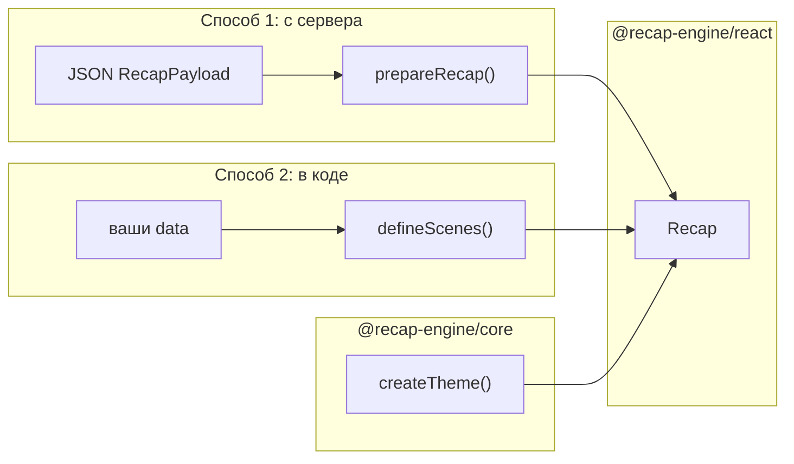

# Архитектура

Эта страница объясняет, **как части библиотеки связаны между собой** — без привязки к вашему приложению.

## Главная идея

Recap — это **плеер сцен**. Вы даёте ему:

- **данные** (`data`) — факты, которые нужно показать;
- **сценарий** (`scenes`) — какие экраны показать и что на каждом написать;
- **тему** (`theme`) — как это выглядит.

Компонент `<Recap>` из `@recap-engine/react` рисует экраны, анимирует переходы и обрабатывает свайпы. Всё остальное — подготовка данных и описание сцен — живёт в `@recap-engine/core`.

## Два пакета

| Пакет | Задача | Примеры |
|-------|--------|---------|
| **core** | Модель данных, описание сцен, форматирование чисел, тема, логика «какая сцена сейчас активна» | `prepareRecap`, `defineScenes`, `createTheme` |
| **react** | Отрисовка в браузере: DOM, CSS-анимации, жесты, хук `useRecap`, колбэк `onEvent` | `<Recap>`, `registerScene` |

Core **не зависит от React**. Его можно вызвать на сервере, чтобы проверить или подготовить payload.

## Откуда берутся data и scenes

Есть **два способа** собрать recap. Оба приводят к одному вызову:

```tsx
<Recap theme={theme} data={data} scenes={scenes} />
```

### Способ 1: данные с сервера

Подходит, если backend уже знает, что показать пользователю.

1. Сервер отдаёт JSON формата [`RecapPayload`](../core/recap-payload) — в нём метрики, тексты и **список экранов** в поле `story`.
2. На клиенте вы вызываете `prepareRecap(payload)`.
3. Функция возвращает готовые `data`, `scenes` и `badges` — их можно сразу передать в `<Recap>`.

```tsx
const payload = await fetch('/api/recap').then((r) => r.json());
const { data, scenes, badges } = prepareRecap(payload);

<Recap theme={theme} data={data} scenes={scenes} badges={badges} />
```

Backend управляет **порядком и составом** экранов через поле `story`. Клиент не описывает сцены вручную.

### Способ 2: всё описываете в коде

Подходит для прототипов, демо или нестандартных сценариев без backend.

1. Вы создаёте объект `data` с любыми полями.
2. Описываете массив сцен через `defineScenes([...])` — каждый элемент это один экран (intro, stat, outro…).
3. Передаёте оба в `<Recap>`.

```tsx
const data = { userName: 'Максим', ads: 12 };

const scenes = defineScenes([
  { id: 'intro', type: ESceneType.Intro, title: ({ data }) => `${data.userName}, ваш год` },
  { id: 'stat', type: ESceneType.Stat, title: 'Объявлений', value: ({ data }) => data.ads },
]);

<Recap theme={theme} data={data} scenes={scenes} />
```

## Схема потока



## Ключевые понятия

**Сцена** — один полноэкранный шаг recap: приветствие, число, текст, бейдж, финал. У каждой сцены есть `id` и `type` (`intro`, `stat`, `insight`, …). Подробнее — [Типы сцен](../core/scene-types).

**RecapPayload** — JSON-контракт от backend: метрики + упорядоченный список экранов (`story`). Подробнее — [RecapPayload](../core/recap-payload).

**Тема** — цвета и шрифты через `createTheme()`. Подробнее — [Тема](../core/theme).

## Импорты

Обычно достаточно одного пакета — react реэкспортирует core:

```tsx
import { prepareRecap, createTheme, Recap, ESceneType } from '@recap-engine/react';
```

Если React не нужен (сервер, тесты):

```ts
import { prepareRecap, type RecapPayload } from '@recap-engine/core';
```

## Связанное

- [Быстрый старт](./quickstart) — способ 2 в действии
- [prepareRecap](../core/prepare-recap) — способ 1 подробнее
- [Компонент Recap](../react/recap) — все props плеера
