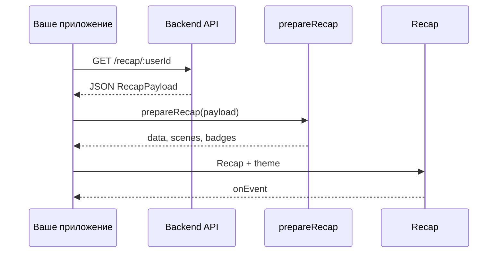

# Интеграция с backend

Этот гайд — для случая, когда **сервер уже отдаёт готовый JSON** с метриками и списком экранов. Клиент не описывает сцены вручную.

## Общая схема



1. Backend собирает метрики пользователя и **сценарий** (какие экраны показать).
2. Отдаёт один JSON — [`RecapPayload`](../core/recap-payload).
3. Клиент вызывает `prepareRecap(payload)` — получает готовые props.
4. Передаёт их в `<Recap>`.

## Что должен отдавать backend

Минимум три блока в JSON:

| Блок | Содержимое |
|------|------------|
| `meta` | Имя пользователя, год, язык (`locale`) |
| `metrics` | Словарь чисел и списков по ключам |
| `story` | Упорядоченный массив экранов |

Пример элемента `story` для stat-экрана:

```json
{
  "type": "stat",
  "id": "listings",
  "metricKey": "listingsPublished",
  "percentileKey": "listingsPercentile"
}
```

Backend указывает **какую метрику** показать на экране. Тексты можно переопределить через `narrative.scenes`.

## Код на клиенте

```tsx
import { prepareRecap, createTheme, Recap, type RecapPayload } from '@recap-engine/react';
import '@recap-engine/react/styles.css';

async function loadRecap(userId: string) {
  const payload: RecapPayload = await fetch(`/api/recap/${userId}`).then((r) => r.json());
  return prepareRecap(payload);
}

function RecapScreen({ userId }: { userId: string }) {
  const [prepared, setPrepared] = useState(null);

  useEffect(() => {
    loadRecap(userId).then(setPrepared);
  }, [userId]);

  if (!prepared) return <Spinner />;

  return (
    <Recap
      {...prepared}
      theme={createTheme()}
      locale={prepared.locale}
      autoplay={{ delayMs: 5000 }}
    />
  );
}
```

## Типы экранов в story

| type в story | Что покажет Recap |
|--------------|-------------------|
| `intro` | Приветствие |
| `stat` | Число (нужен `metricKey`) |
| `insight` | Текстовый инсайт |
| `achievement` | Бейдж (`badgeId`) |
| `blocks` | Несколько блоков |
| `upsell` | Промо |
| `outro` | Финал, часто с кнопками |
| `custom` | Ваш экран (`sceneType` + `registerScene` на клиенте) |

## Custom scene из backend

Backend может добавить в `story`:

```json
{
  "type": "custom",
  "id": "top-categories",
  "sceneType": "top-categories",
  "props": { "metricKey": "favoriteCategories" }
}
```

На клиенте зарегистрируйте компонент с тем же `sceneType` — см. [Кастомные сцены](../react/custom-scenes).

## Проверка payload на сервере

Core не требует React — можно вызвать `prepareRecap` на backend или в CI, чтобы убедиться, что JSON валиден:

```ts
import { prepareRecap, type RecapPayload } from '@recap-engine/core';

prepareRecap(payload as RecapPayload); // упадёт, если story некорректен
```

## Связанное

- [RecapPayload](../core/recap-payload)
- [prepareRecap](../core/prepare-recap)
- [События](../react/events)
